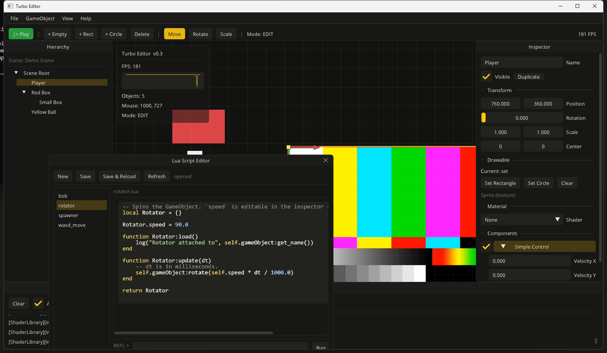

<h1 align="center">Turbo Engine</h1>
<h3 align="center">A C++17 2D game engine &amp; editor built on Allegro 5</h3>

<div align="center">

[](https://github.com/mariusvn/turbo-engine/actions/workflows/build.yml)
[](https://mariusvn.github.io/turbo-engine/)
[](LICENSE)

<a href="https://github.com/mariusvn/turbo-engine/releases">Releases</a>
&nbsp;·&nbsp;
<a href="https://mariusvn.github.io/turbo-engine/">Documentation</a>

</div>

----

<p align="center">
  
</p>

Turbo Engine is a small, self-contained 2D game engine organised around a classic
**Scene → GameObject → Component** model. The demo ships a full **Dear ImGui editor** with
gizmos, a material/shader system and **Lua scripting** (à la Unity) — including an in-editor
code editor with syntax highlighting and live hot-reload.

The whole dependency stack (Allegro 5, Dear ImGui, Lua, sol2 and their transitive deps) is
fetched and built automatically through **vcpkg in manifest mode**, so a plain
`cmake -B build` works on Windows, Linux and macOS with no manual setup.

## Features

### Editor
- **Tiled layout** (no Dear ImGui docking dependency): hierarchy, inspector, console, stats and
  a viewport that shows the live scene behind the panels.
- **Scene hierarchy** — select, create (empty / rectangle / circle), duplicate (`Ctrl+D`),
  delete, rename.
- **Inspector** — transform, visibility, drawable properties (size / radius / colour / fill),
  material picker with data-driven uniform editors, components.
- **Gizmos** — in-viewport **Move / Rotate / Scale** handles (`W` / `E` / `R`), correct under
  nested, rotated and scaled parents.
- **Play / Pause** toggles scene simulation (edit mode vs. play mode).
- Engine-log **console**, resizable window, viewport grid, and a custom flat dark/yellow theme.

### Rendering & shaders
- Allegro 5 renderer with a **vsync-paced, uncapped frame rate**.
- **Material / shader system**: a `ShaderLibrary` owns named GLSL programs and materials;
  materials hold typed uniforms and bind them at draw time.
- Built-in sample shaders applicable per-object: **Tint, Grayscale, Invert, Pulse, Scanlines**.
- A shader-based **selection outline** around the selected object.

### Lua scripting (sol2)
- Components written in **Lua**, with `load` / `update(dt)` / `on_enable` / `on_disable` /
  `unload` lifecycle and an injected `self.gameObject`.
- A rich bound API: `find` / `spawn` / `destroy`, transform & hierarchy access, drawable &
  material helpers, input (`is_key_pressed`, `Key.*`), logging, time.
- **Public script fields are editable in the inspector** (like Unity's serialized fields).
- An **in-editor Lua code editor**: monospace font, **basic syntax highlighting**, save,
  **hot-reload** of live components, and a **REPL** running against the shared Lua state.

### Engine core
- Scene / GameObject / Component composition, an event system, a `Transform` with a 2D matrix.
- RAII resource ownership (textures, fonts, shaders, materials) and recursive scene cleanup.

## Build & run

Requirements: **CMake ≥ 3.21**, a C++17 compiler, and Git (vcpkg is bootstrapped automatically).
On Linux you also need Allegro's build prerequisites (X11/OpenGL/audio dev headers, autotools,
nasm — see [`.github/workflows/build.yml`](.github/workflows/build.yml) for the exact list).

```bash
# Engine + demo, without the editor overlay (Dear ImGui OFF — default)
cmake -B build
cmake --build build

# With the full editor (Dear ImGui ON) — this is what the screenshot shows
cmake -B build -DTURBO_ENABLE_IMGUI=ON
cmake --build build
```

Run the demo from the build's `bin/` directory (assets and dependency libraries are deployed
next to the executable):

```bash
./build/bin/demo          # or build\bin\Debug\demo.exe on multi-config generators
```

> The first configure compiles Allegro 5 and the other dependencies from source via vcpkg, so it
> takes a while; subsequent builds reuse vcpkg's binary cache.

## Scripting example

Drop a `.lua` file in `assets/scripts/` (or create one from the editor) returning a table:

```lua
-- rotator.lua — spins the GameObject. `speed` is editable in the inspector.
local Rotator = {}

Rotator.speed = 90.0   -- degrees per second

function Rotator:load()
    log("Rotator attached to", self.gameObject:get_name())
end

function Rotator:update(dt)         -- dt in milliseconds
    self.gameObject:rotate(self.speed * dt / 1000.0)
end

return Rotator
```

Attach it from the inspector (**+ Add Script**), then press **Play**. Sample scripts —
`rotator`, `bob`, `wasd_move`, `spawner` — live in [`assets/scripts/`](assets/scripts).

## Minimal embedding

```cpp
#include <turbo/Engine.hpp>

class MyScene : public turbo::Scene { /* override load()/unload() */ };

int main(int argc, char** argv) {
    (void)argc; (void)argv;
    turbo::Engine engine;
    auto* scene = new MyScene();
    engine.scene_manager.register_scene(scene, "Main");
    engine.scene_manager.set_active_scene("Main");
    engine.start_window("My Game", 1280, 720);
    engine.loop();
    engine.stop_window();
    return 0;
}
```

## Project layout

```
include/turbo/        public headers
  editor/             ImGui editor + gizmo
  graphics/           drawables, textures, shaders, materials, shader library
  script/             Lua scripting (ScriptEngine, LuaComponent)
src/                  implementation (mirrors include/)
assets/scripts/       sample Lua scripts
docs/                 generated Doxygen documentation
main.cpp              the editor demo
```

## Documentation

API documentation is generated with **Doxygen** (`doxygen Doxyfile` → `docs/`) and published at
**[mariusvn.github.io/turbo-engine](https://mariusvn.github.io/turbo-engine/)**.

## License

[MIT](LICENSE) © Marius Van Nieuwenhuyse
